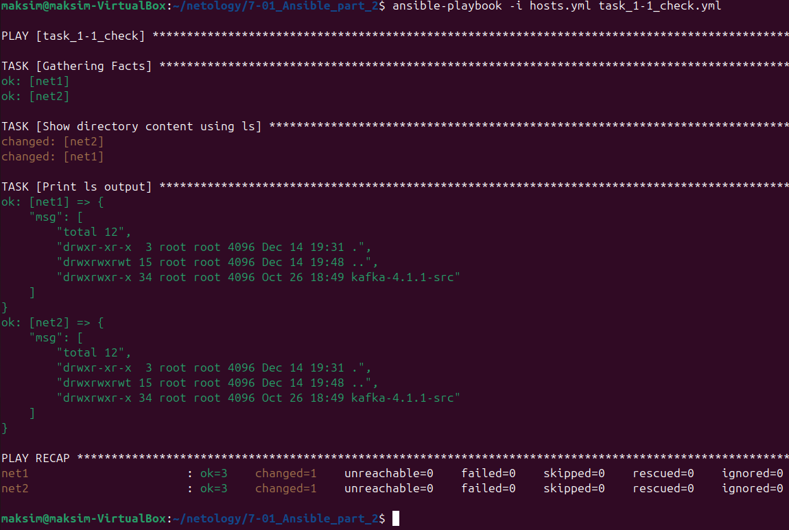
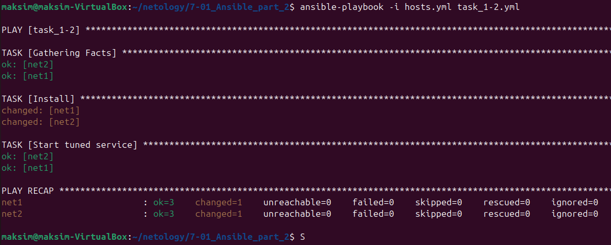
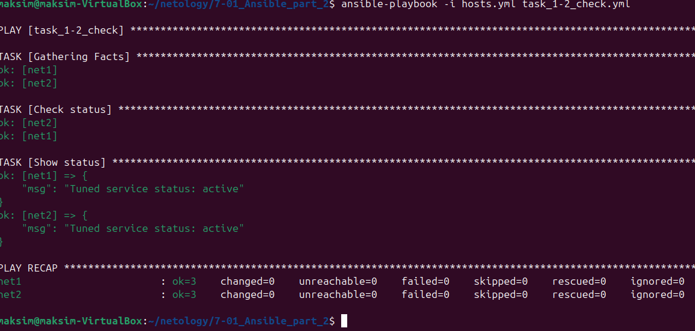
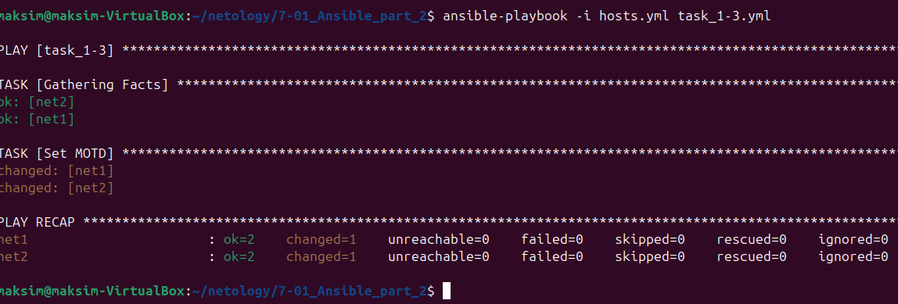
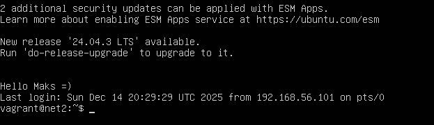
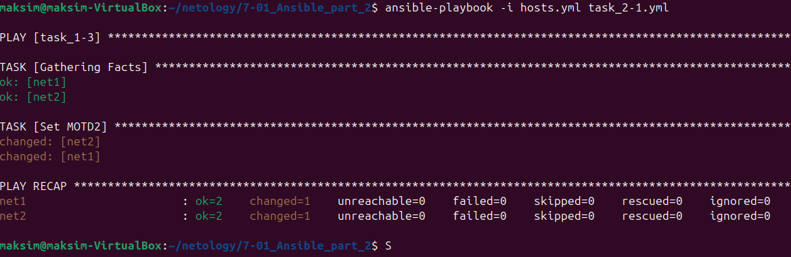
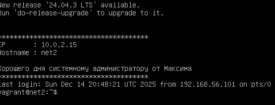
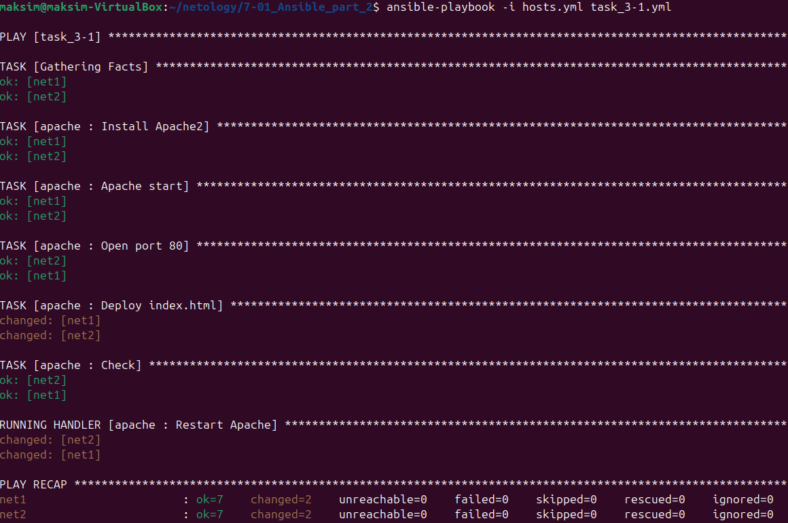
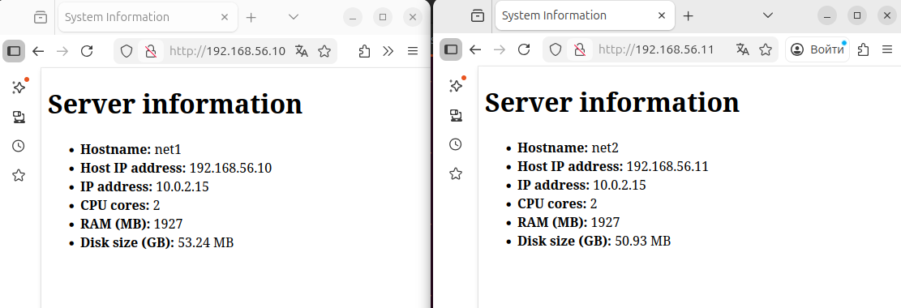

# Домашнее задание к занятию **"Ansible.Часть 2"** - *Клочек Максим Евгеньевич*

Vagrantfile - создание VM

playbook.yml - донастройка VM

В Winodws запуск `vagrant up`

В Winodws удаление `vagrant destroy -f`


### Задание 1

**Выполните действия, приложите файлы с плейбуками и вывод выполнения.**

Напишите три плейбука. При написании рекомендуем использовать текстовый редактор с подсветкой синтаксиса YAML.

Плейбуки должны: 

1. Скачать какой-либо архив, создать папку для распаковки и распаковать скаченный архив. Например, можете использовать [официальный сайт](https://kafka.apache.org/downloads) и зеркало Apache Kafka. При этом можно скачать как исходный код, так и бинарные файлы, запакованные в архив — в нашем задании не принципиально.
2. Установить пакет tuned из стандартного репозитория вашей ОС. Запустить его, как демон — конфигурационный файл systemd появится автоматически при установке. Добавить tuned в автозагрузку.
3. Изменить приветствие системы (motd) при входе на любое другое. Пожалуйста, в этом задании используйте переменную для задания приветствия. Переменную можно задавать любым удобным способом.
---

1.  Решение в файле task_1-1.yml. Для проверки дополнительно сделал task_1-1_check.yml
``` yml 
---
- hosts: all
  become: yes
  name: task_1-1

  vars:
    download_path: "~/apache.tgz"
    extract_dir: "~/extract"

  tasks:
    - name: Download archive
      get_url:
        url: "https://dlcdn.apache.org/kafka/4.1.1/kafka-4.1.1-src.tgz"
        dest: "{{ download_path }}"
        mode: '0644'

    - name: Create directory
      file:
        path: "{{ extract_dir }}"
        state: directory
        mode: '0755'

    - name: Extract archive
      unarchive:
        src: "{{ download_path }}"
        dest: "{{ extract_dir }}"
        remote_src: yes
```
Выполнение

Проверка


2. Решение в файле task_1-2.yml. Для проверки дополнительно сделал task_1-2_check.yml
``` yml 
---
- hosts: all
  become: yes
  name: task_1-2

  tasks:
    - name: Install
      apt: 
        name: tuned
        state: present
        update_cache: yes

    - name: Start tuned service
      systemd:
        name: tuned
        state: started
        enabled: yes

```
Выполнение

Проверка


3. Решение в файле task_1-2.yml.
``` yml 
---
- hosts: all
  become: yes
  name: task_1-3

  vars:
    motd_message: Hello Maks =)

  tasks:
    - name: Set MOTD
      copy:
        content: "{{ motd_message }}"
        dest: /etc/motd
        owner: root
        group: root
        mode: '0644'
```

Выполнение

Проверка


---

### Задание 2

**Выполните действия, приложите файлы с модифицированным плейбуком и вывод выполнения.** 

Модифицируйте плейбук из пункта 3, задания 1. В качестве приветствия он должен установить IP-адрес и hostname управляемого хоста, пожелание хорошего дня системному администратору. 
---

1. Решение в файле task_1-2.yml.
``` yml 
---
- hosts: all
  become: yes
  name: task_1-3

  vars:
    motd_message: Хорошего дня системному администратору от Максима

  tasks:
    - name: Set MOTD2
      copy:
        content: |
          **************************************
          IP       : {{ ansible_default_ipv4.address }}
          Hostname : {{ ansible_hostname }}
         
          {{ admin_wish }}
          **************************************
        dest: /etc/motd
        owner: root
        group: root
        mode: '0644'
```
Выполнение

Проверка



---

### Задание 3

**Выполните действия, приложите архив с ролью и вывод выполнения.**

Ознакомьтесь со статьёй [«Ansible - это вам не bash»](https://habr.com/ru/post/494738/), сделайте соответствующие выводы и не используйте модули **shell** или **command** при выполнении задания.

Создайте плейбук, который будет включать в себя одну, созданную вами роль. Роль должна:

1. Установить веб-сервер Apache на управляемые хосты.
2. Сконфигурировать файл index.html c выводом характеристик каждого компьютера как веб-страницу по умолчанию для Apache. Необходимо включить CPU, RAM, величину первого HDD, IP-адрес.
Используйте [Ansible facts](https://docs.ansible.com/ansible/latest/playbook_guide/playbooks_vars_facts.html) и [jinja2-template](https://linuxways.net/centos/how-to-use-the-jinja2-template-in-ansible/). Необходимо реализовать handler: перезапуск Apache только в случае изменения файла конфигурации Apache.
4. Открыть порт 80, если необходимо, запустить сервер и добавить его в автозагрузку.
5. Сделать проверку доступности веб-сайта (ответ 200, модуль uri).

В качестве решения:
- предоставьте плейбук, использующий роль;
- разместите архив созданной роли у себя на Google диске и приложите ссылку на роль в своём решении;
- предоставьте скриншоты выполнения плейбука;
- предоставьте скриншот браузера, отображающего сконфигурированный index.html в качестве сайта.

  ---

[Архив с ролью](apache_role.tar.gz)

Плэйбук для роли в файле [task_3-1.yml](task_3-1.yml)

Роль находится в папке role/apache

В [roles/apache/defaults/main.yml](roles/apache/defaults/main.yml) переменная с номером порта

В [roles/apache/handlers/main.yml](roles/apache/handlers/main.yml) задача запускаемая при изменении index.html.j2

В [roles/apache/tasks/main.yml](roles/apache/tasks/main.yml) отсновные задачи

В [roles/apache/templates/index.html.j2](roles/apache/templates/index.html.j2) Шаблон для index.html

Выполнение

Изменили index.html.j2

Проверка

